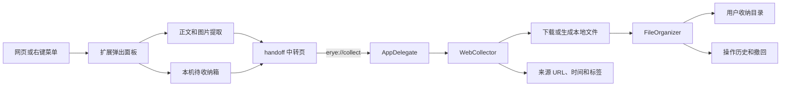

# 云长卫项目结构说明

本文档用于开发交接、模块定位和发布维护。项目目前由 macOS 桌面端、浏览器扩展、正式官网、离线网页小工具和宣发素材五部分组成。

## 一、整体结构

```text
项目1/
├── Sources/PetSorter/          macOS 桌面 App 源代码
│   └── Resources/              应用图标、角色立绘和动画资源
├── browser-extension/          Chrome/Edge 扩展，兼容转换为 Safari Web Extension
├── website/                    正式官网，独立 Git 项目
├── minitool-dist/              可离线运行的网页小工具
├── scripts/                    App 和 DMG 构建脚本
├── marketing/                  宣传图、短视频及其生成工程
├── skills/                     本地 Skill 开发副本，不参与产品运行
├── dist/                       本机生成的 App、DMG 等发布产物
├── .build/                     Swift Package Manager 构建缓存
├── Package.swift               Swift 包及桌面端编译入口
├── AppInfo.plist               macOS App 名称、版本、图标和 URL Scheme
├── 一键打包.command             Finder 中可双击的一键打包入口
├── README.md                   项目总览和使用说明
└── 云长卫-规划.md               产品路线与版本规划
```

## 二、macOS 桌面端

桌面端位于 `Sources/PetSorter/`，使用 SwiftUI、AppKit 和 Swift Package Manager，最低支持 macOS 13。

| 文件 | 职责 |
|---|---|
| `PetSorterApp.swift` | 应用入口和 `AppDelegate`；管理桌宠、设置窗口、引导、自动巡查、更新检查及 `erye://` 深链 |
| `PetView.swift` | 桌宠主界面、拖放入口、右键菜单、角色反馈和战报展示 |
| `CharacterSystem.swift` | 角色皮肤、兵器、主题、节日状态和台词系统 |
| `SettingsView.swift` | 常规、自动化、军令、战报和版本更新等设置界面 |
| `SettingsStore.swift` | 用户设置、八分类目录、自定义军令和桌宠偏好的本机持久化 |
| `FileOrganizer.swift` | 文件分类、规则匹配、重复检测、智能命名、移动、预览和撤回 |
| `OperationHistoryStore.swift` | 最近操作记录、网页导入记录、撤回和今日战报 |
| `FolderPatrolService.swift` | 桌面及下载目录的定时巡查、风险过滤和清理提醒 |
| `WebCollector.swift` | 接收浏览器扩展深链；下载网页素材、生成 Markdown/书签、写入来源元数据 |
| `OnboardingView.swift` | 首次运行时选择收纳目录和示例拖放引导 |
| `UpdateService.swift` | GitHub Releases 版本检查和下载入口 |

### Resources

`Sources/PetSorter/Resources/` 保存会被打入 App Bundle 的资源：

- `AppIcon.icns`：应用正式图标。
- `guan-yu-idle.png`：桌宠待机状态。
- `guan-yu-receiving.png`：接收文件状态。
- `guan-yu-failure.png`：处理失败状态。
- `guan-yu-complete.png`：整理完成状态。
- `guan-yu-skin-*.png`：可切换角色皮肤。
- `sword-animation/`：兼容保留的挥刀动画帧。

### 本机数据位置

- 用户设置和军令：`UserDefaults`。
- 操作历史：用户 `Application Support/二爷收着/history.json`。
- 实际文件：用户在首次引导或设置中选择的总收纳目录。
- 网页来源信息：导入文件的 `com.yunchangwei.web-source` 扩展属性。

## 三、浏览器扩展

`browser-extension/` 是 Manifest V3 WebExtension。Chrome、Edge 可直接加载；Safari 通过 Xcode 的 Safari Web Extension Converter 创建容器工程。

```text
browser-extension/
├── manifest.json               扩展名称、版本、权限和入口声明
├── service-worker.js           右键菜单、待收纳箱和桌面投递调度
├── content-script.js           提取当前网页正文和高质量图片
├── popup.html/css/js           工具栏弹出面板
├── inbox.html/css/js           网页素材待收纳箱
├── handoff.html/css/js         erye:// 外部协议中转页
└── README.md                   安装、功能和 Safari 转换说明
```

扩展提供以下入口：

- 当前图片交给二爷。
- 正文保存为 Markdown。
- 当前页面通过系统打印面板保存为 PDF。
- 当前链接加入待收纳箱。
- 页面图片批量收集，单次最多 30 张。
- 右键下载图片、音视频并自动分类。
- 投递时选择目标分类并填写标签。

待收纳箱使用 `chrome.storage.local`，不会自动上传到远程服务器。

## 四、浏览器与桌面端数据流



关键协议为：

```text
erye://collect?url=...&kind=...&title=...&source=...&tags=...&destination=...
```

协议在 `AppInfo.plist` 注册，由 `PetSorterApp.swift` 接收，再交给 `WebCollector.swift` 解析。桌面端只接受 `http` 和 `https` 素材地址，拒绝本地文件和脚本协议。

## 五、正式官网

`website/` 是正式官网工程，采用 React、Next.js、Vinext、Vite 和 Cloudflare/Sites 构建链路。

```text
website/
├── app/layout.tsx              React 页面根布局
├── app/page.tsx                官网主要页面
├── public/                     公开静态资源
├── assets/                     官网角色图和演示视频源素材
├── downloads/                  官网下载按钮指向的 DMG
├── .openai/hosting.json        Sites 托管配置
├── package.json                Node 依赖和开发/构建命令
├── dist/                       网站构建产物
└── node_modules/               本机依赖目录
```

注意：`website/` 内存在自己的 `.git/`，它是嵌套的独立仓库。修改、提交和发布官网时，应先确认当前 Git 工作目录，避免把官网提交到外层仓库或反向误操作。

## 六、离线网页小工具

`minitool-dist/` 是不依赖服务器和 Node 构建的静态网页工具：

```text
minitool-dist/
├── index.html                  单页入口
└── assets/
    ├── main.js                 文件选择、预览、分类和本机统计
    ├── style.css               移动端界面样式
    └── guan-yu.png             页面角色插画
```

该工具只读取用户主动选择的图片或视频，在浏览器中进行预览和类型统计，不会移动源文件，也不承担桌面端的真实整理能力。

## 七、构建与发布

| 入口 | 作用 | 产物 |
|---|---|---|
| `swift run PetSorter` | 本地调试桌面端 | 调试进程 |
| `scripts/build-app.sh` | Release 编译、复制资源并临时签名 | `dist/云长卫.app` |
| `scripts/build-dmg.sh` | 构建 App 并生成安装盘 | `dist/云长卫-版本-架构.dmg` |
| `一键打包.command` | Finder 双击执行 DMG 构建 | 同上 |
| `website` 中的 `npm run dev` | 本地运行官网 | 开发服务器 |
| `website` 中的 `npm run build` | 构建官网 | `website/dist/` |

版本号以根目录 `AppInfo.plist` 中的 `CFBundleShortVersionString` 为桌面端发布基准。浏览器扩展版本位于 `browser-extension/manifest.json`，官网版本位于 `website/package.json`，三处需要在正式发布前人工核对。

> 当前版本状态：桌面端和浏览器扩展已标记为 `0.4.0`，但官网 `package.json`、官网说明和 `website/downloads/` 中的安装包仍为 `0.2.0`。发布 V0.4 前需要重新生成 DMG、替换官网下载文件，并同步官网版本与下载链接。

## 八、宣发与辅助目录

### marketing

`marketing/` 保存小红书图文、宣传片、音频、视频帧和生成脚本。它不参与 App 或官网运行，体积较大的中间文件可在发布包之外单独归档。

主要子目录：

- `xiaohongshu-vibecoding/`：小红书卡片、封面和笔记文案。
- `yunchangwei-v3-build/`：9:16 宣传视频的脚本、素材和渲染结果。
- `video-build/`：旁白、时间轴和中间音频。

### skills 与 .codex

- `skills/`：本地 Skill 的开发副本。
- `.codex/`：Codex 工作流或项目技能配置。

两者属于开发辅助内容，不应被桌面 App、扩展或官网运行时依赖。

## 九、源代码与生成文件边界

需要长期维护和提交的内容：

- `Sources/PetSorter/`
- `browser-extension/`
- `website/` 中除构建缓存和依赖外的源代码
- `minitool-dist/`
- `scripts/`
- `Package.swift`、`AppInfo.plist` 和 Markdown 文档

可以重新生成或重新安装的内容：

- `.build/`
- `dist/`
- `website/node_modules/`
- `website/.next/`
- `website/dist/`
- 宣发视频的临时帧、拼接清单和中间音频

发布前不要把旧 DMG 当作当前源码的验证结果。应重新执行打包脚本，并确认文件名版本与 `AppInfo.plist` 一致。

## 十、常见开发入口

| 要修改的能力 | 首先查看 |
|---|---|
| 文件分类或命名 | `Sources/PetSorter/FileOrganizer.swift` |
| 自定义军令和设置 | `Sources/PetSorter/SettingsStore.swift`、`SettingsView.swift` |
| 桌宠交互和动画 | `Sources/PetSorter/PetView.swift`、`CharacterSystem.swift` |
| 自动巡查 | `Sources/PetSorter/FolderPatrolService.swift` |
| 历史、撤回和战报 | `Sources/PetSorter/OperationHistoryStore.swift` |
| 浏览器投递落盘 | `Sources/PetSorter/WebCollector.swift` |
| 扩展弹出面板 | `browser-extension/popup.*` |
| 右键菜单或待收纳箱 | `browser-extension/service-worker.js`、`inbox.*` |
| 官网页面 | `website/app/page.tsx` |
| 离线网页工具 | `minitool-dist/index.html`、`assets/main.js` |
| App/DMG 打包 | `scripts/build-app.sh`、`scripts/build-dmg.sh` |
